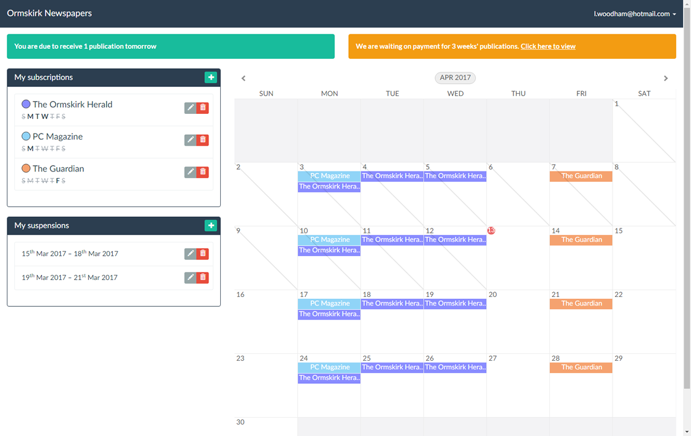
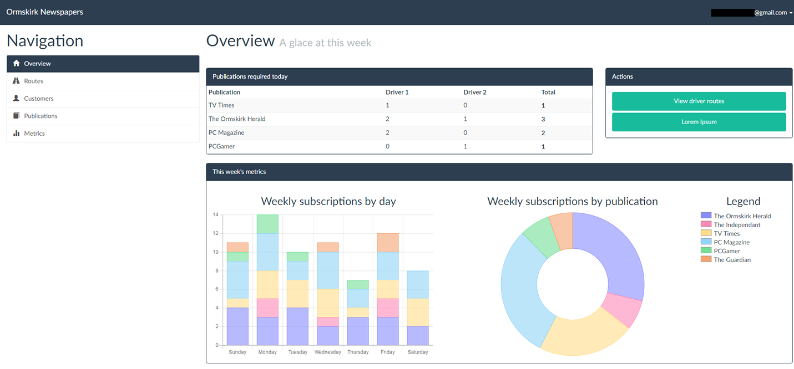
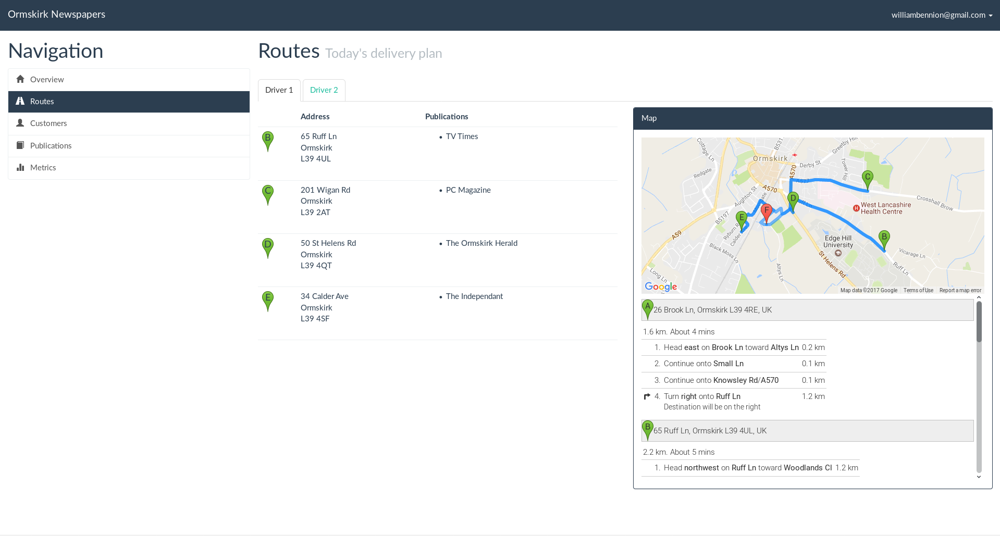

# Newspaper Management System

This is the implementation of a newspaper management system for a mock newsagent company based in Ormskirk, UK.

This was created as coursework for Software Engineering module (of a Year 2 Computing degree) in March/April 2017. Mostly feature-complete (core features such as booking, metrics, calculations complete; other features such as password changing not implemented).

## Screenshots

### Customer view:

### Admin dashboard:

### Notes
- There are two SQL directories:
	- `./sql` directory is for SQL backups and supporting queries (such as the DB structure or sample data).
	- `./app/sql` directory is for SQL that will be dynamically be loaded into the NodeJS server, for example if the code is deemed too large to be embedded in the JS file.
